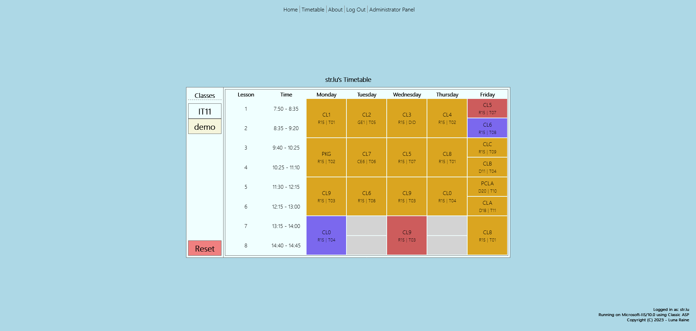

# ActiveTime

* ActiveTime is a small timetable written using ASP, PHP and JS;
* Database powered by MariaDB/MySQL;
* Extensive use of JSON Objects (JSON library used: aspjson.com);



### JSON Options
```json
{
    "name":"CL1",
    "room":"R15",
    "teach":"T01",
    "mode":"",
    "state":"double"
},
```
* Name: Classroom Name
* Room: Room Number
* Teach: Teacher Abbreviation
* Mode: Special Modes. Options: "(Week A)" and "(Week B)"
* State: Lesson State. Options: "single", "double", "empty", "noshow" 
